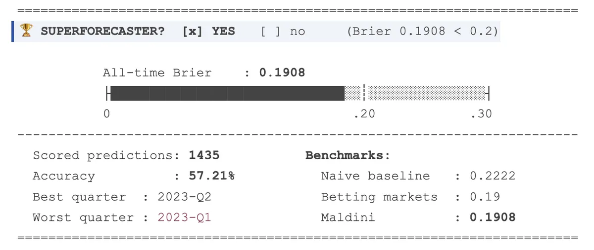
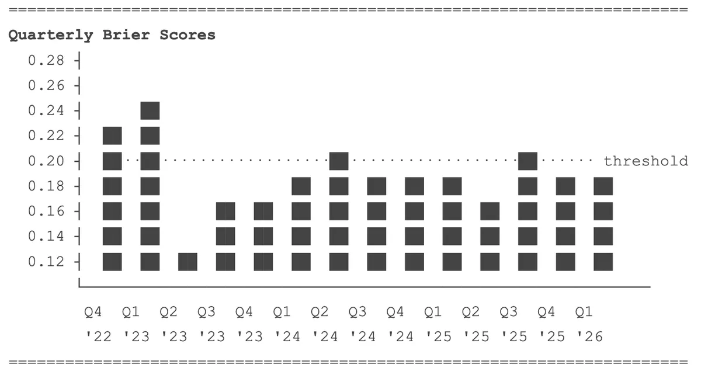
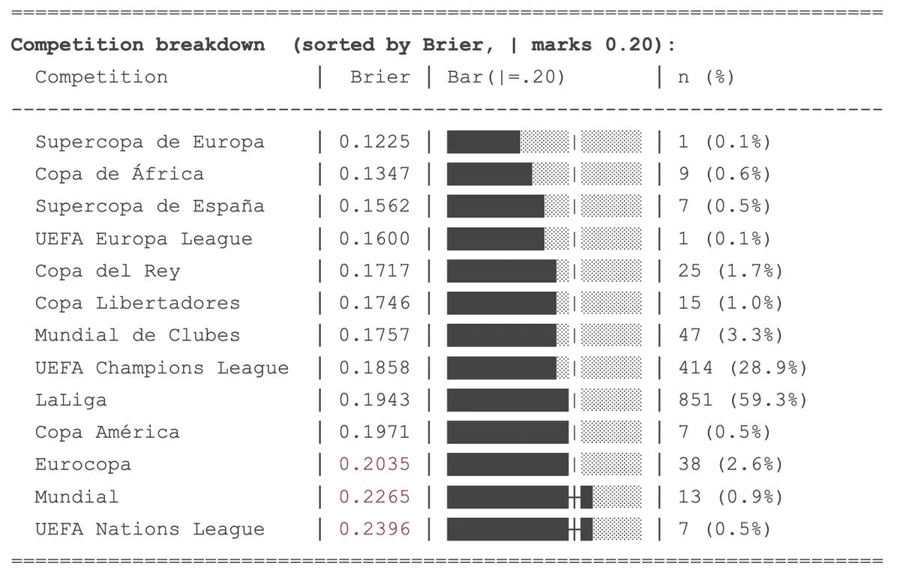
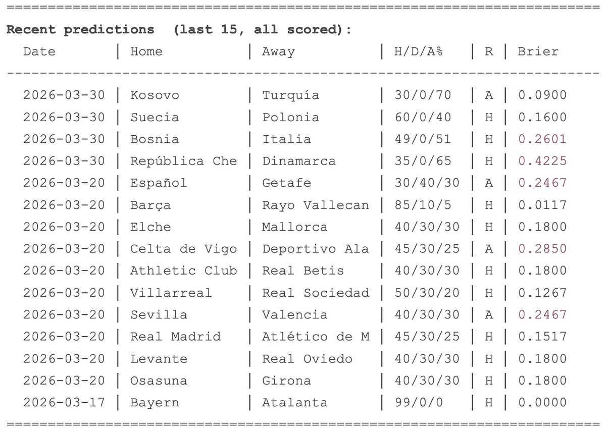

# Maldini

*Maldini* is one of Spain's most prominent football journalists. Every week on his YouTube channel [@mundomaldini](https://www.youtube.com/@mundomaldini) he makes explicit, probabilistic predictions about upcoming matches. This project captures every prediction, scores it objectively with a [Brier score](https://en.wikipedia.org/wiki/Brier_score), and surfaces the answer in a dashboard.


---

## **Is Julio Maldonado ("Maldini") a superforecaster?**

A Brier score measures the accuracy of probabilistic predictions – **lower is better**, 0 is perfect.

| Benchmark | Brier Score |
|---|---|
| Naive baseline (guess 1/3 each outcome) | 0.222 |
| Betting markets | ~0.19 |
| **Superforecaster threshold** | **< 0.20** |
| Perfect forecaster | 0.00 |

Maldini earns the superforecaster badge only when his all-time average Brier score drops below 0.20 – and only once he has 100+ scored predictions for statistical reliability. 

> The project tracks **1,500 predictions** from 2022-Q4 to 2026-Q2.

---

## Analysis

*Snapshot: April 2026, 1,435 scored predictions.*

### The verdict



Maldini's all-time Brier score is **0.1908**. He clears the threshold. One person, performing at the level of the betting markets.

The dataset spans 2022-Q4 to the present, covering LaLiga, Champions League, Copa del Rey, international tournaments. At 1,400+ predictions, the average has had room to stabilise.

### Is it consistent?



Most quarters land below 0.20. Two don't: 2023-Q1 and 2024-Q3. Every other quarter clears it.

A forecaster who averages 0.19 but swings between 0.10 and 0.28 is different from one who sits consistently around 0.18–0.19. Maldini's chart shows the second pattern with occasional spikes. Even Tetlock's superforecasters have bad stretches. The trend matters more than any single quarter, and the trend is flat and below the line.

### Where does he struggle?



The competition breakdown maps to expertise and familiarity.

- **LaLiga** – 59% of all predictions, Brier 0.194. He watches every match, knows every squad. This is the football he knows best.
- **Champions League** – 29% of predictions, Brier 0.186. His best performance by volume.
- The outliers: **World Cup** (0.227, n=13) and **Nations League** (0.240, n=7). International tournaments are harder to predict – less recent form data, higher variance in squads, one-off matches. The scores are above the threshold, but the samples are too small to draw conclusions.

### The recent window



Individual predictions show the full range. Bayern–Atalanta: 99% home, went home. Brier: 0.000. Czech Republic–Denmark: 65% away, home team won. Brier: 0.423.

Single matches are noisy. A confident wrong call gets punished hard. The average smooths this out – that's the point of tracking 1,400+ predictions instead of picking examples.

---

## Architecture

```
                ┌──────────────────────────────────┐
                │  data/videos.csv                 │
                │  data/results_overrides.csv  (*) │
                └─────────────────┬────────────────┘
                                  ▼
┌─────────────────────────────────────────────────────────────────┐
│                       maldini.pipeline                          │
│                                                                 │
│    ┌─────────┐    ┌─────────┐    ┌─────────┐    ┌─────────┐     │
│    │ ingest  │───►│ extract │───►│ results │───►│ scoring │     │
│    └────┬────┘    └────┬────┘    └────┬────┘    └────┬────┘     │
│         ▼              ▼              ▼              ▼          │
│      YouTube         Claude        TheSportsDB     DuckDB       │
│      transcript      Haiku LLM     match data      Brier 2/3w   │
└─────────────────────────────────┬───────────────────────────────┘
                                  ▼
                ┌──────────────────────────────────────┐
                │  data/predictions.parquet            │
                │  one row per prediction; single      │
                │  source of truth, committed to git   │
                └─────────────────┬────────────────────┘
                                  ▼
                ┌──────────────────────────────────────┐
                │            maldini.render            │
                │  DuckDB CTEs  →  summary stats       │
                │  Jinja2       →  dist/index.html     │
                │                  dist/index.en.html  │
                └─────────────────┬────────────────────┘
                                  ▼
                       GitHub Pages (auto)

(*) Manual scoreline fixups for matches TheSportsDB can't auto-resolve.
Schedule: GitHub Actions cron, Sundays 08:00 UTC (.github/workflows/weekly.yml).
```

**Parquet is the single source of truth.** It lives in git, so every dashboard build is reproducible from a commit hash. The pipeline is idempotent – re-running it on the same `videos.csv` only processes new `video_id`s, and pending predictions (matches not yet played) are persisted with null results so the next run picks them up.

---

## Transformation

All SQL runs in **DuckDB** in-process, embedded inside `src/maldini/pipeline.py` (scoring) and `src/maldini/render.py` (summary stats).

Brier score variants:

- **3-outcome** (league matches): `((p_home - I_home)² + (p_draw - I_draw)² + (p_away - I_away)²) / 3`
- **2-outcome** (knockout, where `pred_draw_pct = 0`): renormalise home + away to sum to 1, then `((p_home - I_home)² + (p_away - I_away)²) / 2`

Summary statistics (all-time average, accuracy, monthly trend, competition breakdown, Brier distribution) are computed by `maldini.render` from the parquet at render time – a few short CTEs, no separate materialised tables.

---

## Stack

| Layer | Technology |
|---|---|
| Pipeline | Python package (`src/maldini/`) |
| Transformations | DuckDB (in-process SQL) |
| Storage | Parquet file in git (`data/predictions.parquet`) |
| LLM | Anthropic Claude Haiku |
| External APIs | YouTube Data API v3, youtube-transcript-api, TheSportsDB |
| Dashboard | Jinja2 → static HTML |
| Schedule | GitHub Actions (weekly cron) |
| Hosting | GitHub Pages |

---

## How to run locally

For a full step-by-step guide, see [docs/SETUP.md](docs/SETUP.md). The summary below is enough to get going.

### Prerequisites

```bash
git clone https://github.com/0trm/maldini.git
cd maldini
uv venv && source .venv/bin/activate
uv pip install -e ".[dev]"
cp .env.example .env   # fill in YOUTUBE_API_KEY and ANTHROPIC_API_KEY
```

### Run

```bash
# 1. Ingest, extract, fetch results, score
python -m maldini.pipeline --file data/videos.csv

# 2. Generate static HTML from the parquet
python -m maldini.render

# 3. View
open dist/index.html
```

Equivalently, the package exposes `maldini-pipeline` and `maldini-render` console scripts. Run `pytest` for the unit tests.

To add new videos: append rows to `data/videos.csv` and re-run.

---

## Design notes

- **Parquet lives in git** – every dashboard build is reproducible from a commit hash. If scoring logic changes, rebuild from `data/videos.csv`.
- **DuckDB for everything SQL** – no warehouse, no credentials, no quotas; the whole pipeline runs on a laptop or a free-tier GitHub Actions runner in under a minute.
- **Fuzzy team matching** – normalisation strips accents, common prefixes (`Real`, `Atlético`), and applies Spanish→English word substitutions before substring matching against TheSportsDB results.
- **No-date window** – predictions without a `match_date` use a 45-day window from `publish_date` to find the matching fixture.
- **No-draw handling** – when `pred_draw_pct == 0`, a 2-outcome Brier formula is applied automatically.

---

## Documentation

- [docs/SETUP.md](docs/SETUP.md) – step-by-step local setup and verification
- [docs/DATA_FORMAT.md](docs/DATA_FORMAT.md) – input/output schemas for the pipeline

---

## License

MIT
